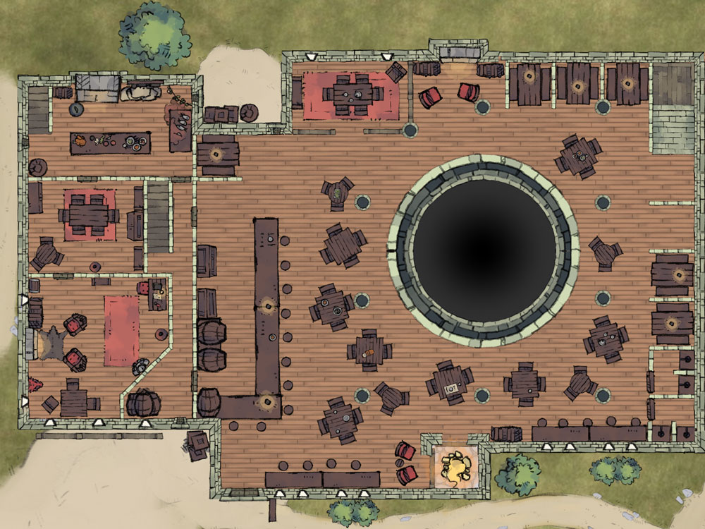

# Locations

### Faerun

Faerûn (pronounced: /feɪˈruːn/ fay-ROON[2] was a major continent on the planet of Toril.

[Image credits](http://forgottenrealms.wikia.com/wiki/Faer%C3%BBn)

### Sword Coast North

[Image credits](https://www.worldanvil.com/w/forgotten-realms-Jalerym/map/6b1e445d-1f6f-4ffe-8969-0ad38785aeb4)

### Yawning Portal

[Image credits](https://steamcommunity.com/sharedfiles/filedetails/?id=903488427)

[Image credits](https://imgur.com/gallery/AD6hviQ)

### City Streets

[Image credits](https://forums.spacebattles.com/threads/the-juubi-naruto-appears-at-the-gates-of-waterdeep-forgotten-realms-d-d.629989/)

### Dock Ward

### Old Xoblob Shop
